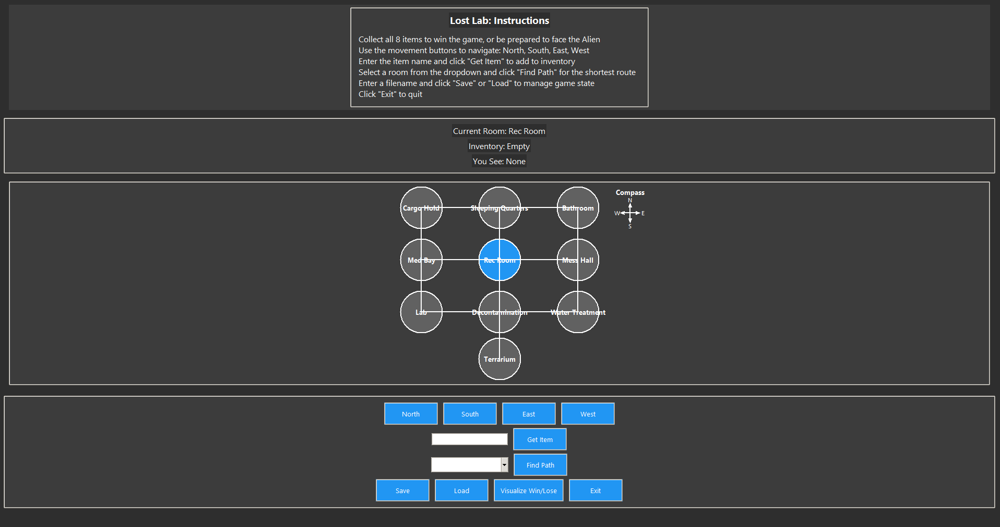

# {{ site.title }}

Welcome to my ePortfolio! 

## Artifact Overview

<!-- OG Running Screenshot -->

  

I used the same artifact for all three enhancements — Software Engineering and Design, Algorithms and Data Structure, and Databases. 
It was the first project I ever worked on at SNHU: a text-based game that served as the final project for course IT-140. 
While simple in design, it was fully functional and a perfect candidate for enhancement in each category. 
This artifact allows a clear comparison of my earliest work at SNHU with the final version presented in my ePortfolio. 

If you would like to view the original LostLab in its entirety, please click the link below.

👉 <a href="https://github.com/zag2493/zag2493.github.io/blob/main/OriginalLostLab.py" target="_blank" rel="noopener noreferrer">View Original Artifact on GitHub</a>

## Code Review Video

In this code review, I first go over the artifact, LostLab.py, the first project I worked on here at SNHU and the artifact chosen for each enhancement. 

Code reviews are an important process in software development as they can catch bugs early, improve functionality, and ensure maintainable and secure code. Following a checklist improves clarity and correctness, helping to check performance, testing, and security, and ensures the code is thoroughly examined before being integrated into the main branch.

To create my code review, I used TechSmith Capture to record my screen and follow a detailed script with key talking points and my code review checklist. I list the strengths and weaknesses of my artifact and highlight potential enhancements for my code.

<iframe width="100%" height="315" 
        src="https://www.youtube.com/embed/t0SVgCdGR3Q"
        title="YouTube video player" 
        frameborder="0" 
        allowfullscreen>
</iframe>

## Software Engineering and Design Enhancement

<!-- Final Game Running Screenshot -->

  

The first enhancement focuses on Software Engineering and Design. The original game LostLab, was a basic, dictionary-driven game that had little input handling and no structure. For the enhancement I focused on an object-oriented application with a Tkinter GUI, focusing on software engineering principles to make it more maintainable, user-friendly, and scalable. 

  <a href="enhancements/software_design.md" 
     style="background-color:#4CAF50; color:white; padding:10px 25px; text-decoration:none; border-radius:5px; font-weight:bold;">
     Read Full Software Engineering & Design Enhancement
  </a>

