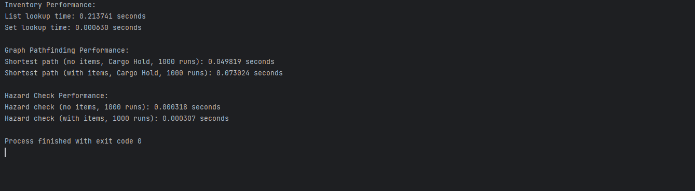
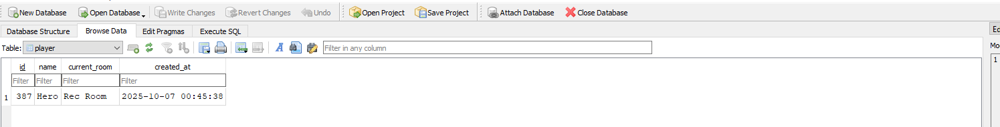

# {{ site.title }}

Hello, my name is Zachariah Garrison, and welcome to my ePortfolio. I attended Southern New Hampshire University from 2023 to 2025, earning my Bachelor’s Degree in Computer Science with a concentration in Software Engineering. My time at SNHU has helped shape my career goals and set me on a new path in the world of technology. The courses I’ve completed have prepared me for a dynamic career in software engineering, emphasizing both technical expertise and professional values.

Developing my ePortfolio, centered around enhancing my first SNHU project Lost Lab, across all three enhancement categories—Software Engineering and Design, Algorithms and Data Structures, and Databases—has allowed me to showcase how far I’ve come as a developer. Comparing my first and final versions of the project highlights my growth in designing robust, user-focused solutions while strengthening my values in collaboration, clarity, and security. Through coursework and hands-on projects, I’ve gained a well-rounded skill set that includes modular design, algorithmic optimization, and secure data management—skills that will enable me to contribute meaningfully to any development team or organization.

Throughout the program, I developed a wide range of technical and professional skills that make me a capable and adaptable software engineer. Early courses like IT 140: Introduction to Scripting introduced me to Python and the fundamentals of structured and object-oriented programming, while DAD 220: Database Systems introduced me to SQL and database design. I also gained experience with languages such as Java and C++. Courses like CS 300: Data Structures and Algorithms and CS 370: Current and Emerging Trends deepened my understanding of algorithmic efficiency and introduced me to advanced topics like machine learning and artificial intelligence. In CS 250: Software Development Lifecycle, I experienced agile-style workflows that taught me how to gather requirements, collaborate in teams, and communicate effectively with stakeholders. Security-focused courses such as CS 305: Software Security and CS 405: Secure Coding trained me to identify and mitigate vulnerabilities using SEI CERT standards—skills that are critical in today’s software industry. Collectively, these courses helped me grow into a well-rounded engineer prepared for real-world software development challenges.

For my capstone artifact, I enhanced my original project from IT 140: Introduction to Scripting, a text-based adventure game built around a flat, dictionary-driven structure. The new version, Lost Lab Enhanced demonstrates growth across all three enhancement categories. It includes the enhanced game, comprehensive unit tests, and a performance analysis module to measure key metrics.
•	Software Engineering and Design: Implemented modular OOP architecture, a Tkinter GUI featuring a grid-based map, compass, and timed path highlighting, along with a full suite of unit tests to ensure reliability.
•	Algorithms and Data Structures: Integrated a NetworkX graph for dynamic navigation, used set-based inventories for faster lookups (with measured performance), and implemented Dijkstra’s algorithm for optimal pathfinding.
•	Databases: Added SQLite-based save/load functionality with tables for player data, inventory, rooms, and logs, supporting CRUD operations and generating win/lose visualizations using MatPlotLib.
These enhancements form a cohesive portfolio, demonstrating how software design, data structures, and databases work together to create an efficient, user-friendly system. Object-oriented principles enable flexible navigation, graph algorithms optimize pathfinding, and SQLite ensures data persistence. This portfolio not only showcases my technical capabilities but also reflects my growth from a novice coder to a confident software engineer ready to take on real-world challenges in the field.

## Artifact Overview

<!-- OG Running Screenshot -->

  

I used the same artifact for all three enhancements — Software Engineering and Design, Algorithms and Data Structure, and Databases. 
It was the first project I ever worked on at SNHU: a text-based game that served as the final project for course IT-140. 
While simple in design, it was fully functional and a perfect candidate for enhancement in each category. 
This artifact allows a clear comparison of my earliest work at SNHU with the final version presented in my ePortfolio. 

If you would like to view the original LostLab in its entirety, please click the link below.

  <a href="https://github.com/zag2493/zag2493.github.io/blob/main/OriginalLostLab.py" 
     target="_blank" 
     rel="noopener noreferrer"
     style="background-color:#4CAF50; color:white; padding:10px 25px; text-decoration:none; border-radius:5px; font-weight:bold;">
     View Original Artifact on GitHub
  </a>

## Code Review Video

In this code review, I first go over the artifact, LostLab.py, the first project I worked on here at SNHU and the artifact chosen for each enhancement. 

Code reviews are an important process in software development as they can catch bugs early, improve functionality, and ensure maintainable and secure code. Following a checklist improves clarity and correctness, helping to check performance, testing, and security, and ensures the code is thoroughly examined before being integrated into the main branch.

To create my code review, I used TechSmith Capture to record my screen and follow a detailed script with key talking points and my code review checklist. I list the strengths and weaknesses of my artifact and highlight potential enhancements for my code.

<iframe width="100%" height="315" 
        src="https://www.youtube.com/embed/t0SVgCdGR3Q"
        title="YouTube video player" 
        frameborder="0" 
        allowfullscreen>
</iframe>

## Software Engineering and Design Enhancement

<!-- Final Game Running Screenshot -->

  

The first enhancement focuses on Software Engineering and Design. The original game LostLab, was a basic, dictionary-driven game that had little input handling and no structure. For the enhancement I focused on an object-oriented application with a Tkinter GUI, focusing on software engineering principles to make it more maintainable, user-friendly, and scalable. 

<a href="/enhancements/software_design/" 
   style="background-color:#4CAF50; color:white; padding:10px 25px; text-decoration:none; border-radius:5px; font-weight:bold;">
   Read Full Software Engineering & Design Enhancement
</a>

## Algorithms and Data Structure Enhancement 

<!-- Performance Screenshot -->

  

The second enhancement targets Algorithms and Data Structure, this transforms Lost Lab from a basic, list-based navigation system into an optimized, graph driven application. By using NetworkX for weighted graphs, set-based inventory, and Dijkstra's algorithm for pathfinding features, this enhancement brings efficiency and scalability.

<a href="/enhancements/algorithms/" 
   style="background-color:#4CAF50; color:white; padding:10px 25px; text-decoration:none; border-radius:5px; font-weight:bold;">
   Read Full Algorithms and Data Structure Enhancement
</a>

 

## Databases

<!-- Database Screenshot -->

  

The third enhancement focuses on Databases, elevating Lost Lab by creating a persistent application using SQLite. By implementing tables for player, inventory, rooms, and logs with CRUD operations and queries for win/lose visualization, this upgrade ensures robust data management and analytics, replacing the original's temporary state with scalable, secure storage. 

<a href="/enhancements/databases/" 
   style="background-color:#4CAF50; color:white; padding:10px 25px; text-decoration:none; border-radius:5px; font-weight:bold;">
   Read Full Database Enhancement
</a>

  <a href="https://github.com/zag2493/zag2493.github.io/blob/main/LostLabEnhanced.py" 
     target="_blank" 
     rel="noopener noreferrer"
     style="background-color:#4CAF50; color:white; padding:10px 25px; text-decoration:none; border-radius:5px; font-weight:bold;">
     View Lost Lab Enhanced on GitHub
  </a>

  <a href="https://github.com/zag2493/zag2493.github.io/blob/main/test_Lost_Lab_Enhanced.py" 
     target="_blank" 
     rel="noopener noreferrer"
     style="background-color:#4CAF50; color:white; padding:10px 25px; text-decoration:none; border-radius:5px; font-weight:bold;">
     View Lost Lab Unit Tests on GitHub
  </a>

  <a href="https://github.com/zag2493/zag2493.github.io/blob/main/performance.py" 
     target="_blank" 
     rel="noopener noreferrer"
     style="background-color:#4CAF50; color:white; padding:10px 25px; text-decoration:none; border-radius:5px; font-weight:bold;">
     View Lost Lab Performance File on GitHub
  </a>

